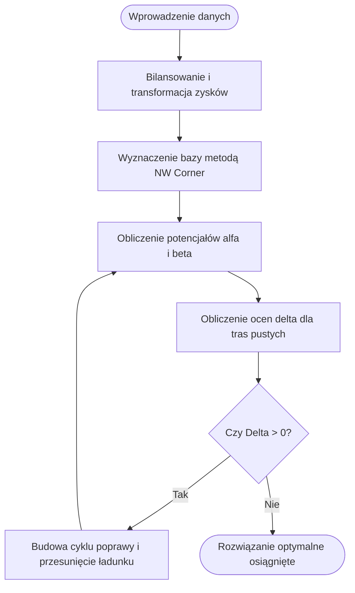

# Sprawozdanie: Optymalizacja zagadnienia pośrednika

**Autorzy:** Wiktoria Wachel, Dawid Szarek (Grupa nr 3)  
**Przedmiot:** Badania Operacyjne i Logistyka  
**Kierunek:** ITE, Studia stacjonarne  
**Data:** 10 maja 2026 r.

---

## 1. Wstęp
Celem projektu było opracowanie i implementacja aplikacji dedykowanej do rozwiązywania zagadnienia pośrednika. Problem stanowi rozszerzenie zagadnienia transportowego, w którym celem nie jest tylko minimalizacja kosztów przewozu, ale maksymalizacja zysku wynikającego z różnicy między cenami sprzedaży a sumą kosztów zakupu i transportu.

## 2. Wykorzystane technologie
Aplikacja została zbudowana w oparciu o nowoczesny stos technologiczny, zapewniający wysoką wydajność obliczeniową i responsywność interfejsu użytkownika.

| Warstwa | Technologia / Biblioteka | Rola w projekcie |
| :--- | :--- | :--- |
| **Szkielet aplikacji** | Next.js (App Router) | Zarządzanie strukturą projektu, routingiem i optymalizacja renderowania. |
| **Logika obliczeniowa** | TypeScript | Implementacja algorytmów z silnym typowaniem danych. |
| **Interfejs użytkownika** | Tailwind CSS + Shadcn/ui | Zapewnienie estetycznego, spójnego i przejrzystego wyglądu aplikacji. |
| **Wizualizacja grafów** | React Flow | Generowanie dynamicznych i interaktywnych modeli przepływów towarowych. |
| **Zarządzanie stanem** | Zustand | Obsługa danych wejściowych, wyników i historii iteracji algorytmu. |

## 3. Implementacja algorytmiczna
Proces wyznaczania planu optymalnego w aplikacji przebiega w sposób wieloetapowy.

### Modelowanie i bilansowanie
Pierwszym krokiem silnika jest transformacja danych wejściowych (ceny i koszty) na macierz zysków. W przypadku wykrycia dostawców blokowanych przez użytkownika, system stosuje metodę wielkiego M, przypisując im ogromną ujemną karę.

Aplikacja dba o zbalansowanie układu. W sytuacji nierówności podaży i popytu, implementowana jest logika dodawania węzłów fikcyjnych (dostawcy i odbiorcy), co pozwala na zachowanie spójności matematycznej modelu przy zachowaniu realnych ograniczeń biznesowych.

### Algorytmy optymalizacyjne
Rozwiązanie problemu odbywa się poprzez dwie kluczowe metody:

1.  **Metoda kąta północno-zachodniego (NW Corner)**: Służy do wyznaczenia pierwszego rozwiązania bazowego. W systemie zaimplementowano rozszerzenie tej metody o mechanizm priorytetyzacji, który pozwala na zabezpieczenie podaży blokowanych dostawców w pierwszej kolejności.
2.  **Metoda potencjałów**: Stanowi główny silnik optymalizacyjny. Algorytm w sposób iteracyjny wylicza zmienne dualne ($\alpha$ dla dostawców, $\beta$ dla odbiorców) i oceny $\Delta$ dla tras nieużywanych. Proces trwa aż do momentu, gdy wszystkie oceny $\Delta$ staną się niedodatnie, co sygnalizuje osiągnięcie optimum.

## 4. Prezentacja wyników i wizualizacja
Użytkownik otrzymuje dostęp do:
- **Macierzy transportowej** - prezentującej szczegółowe przydziały, wartości potencjałów i oceny każdej z tras.
- **Interaktywnego grafu** - zbudowanego na bibliotece React Flow, który pozwala na wizualne śledzenie przepływu towarów. Węzły na grafie można dowolnie przesuwać, co ułatwia analizę w przypadku dużej liczby połączeń.
- **Historii iteracji** - możliwości prześledzenia każdego kroku algorytmu, co pozwala zrozumieć proces dochodzenia do ostatecznego wyniku.

## 5. Wnioski
Zrealizowany projekt w pełni realizuje zagadnienie pośrednika. Zastosowanie TypeScript pozwoliło na stworzenie stabilnego i odpornego na błędy silnika matematycznego, który poprawnie obsługuje nawet najbardziej złożone przypadki (układy niezbilansowane, blokady połączeń).

Interfejs użytkownika, oparty na nowoczesnych standardach webowych, zapewnia intuicyjną obsługę bez konieczności posiadania wiedzy technicznej. Możliwość wizualizacji algorytmu krok po kroku sprawia, że aplikacja posiada również wartości edukacyjne.
